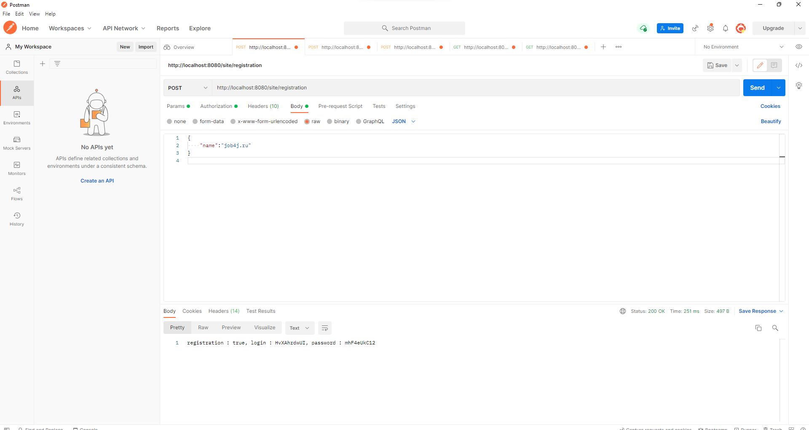
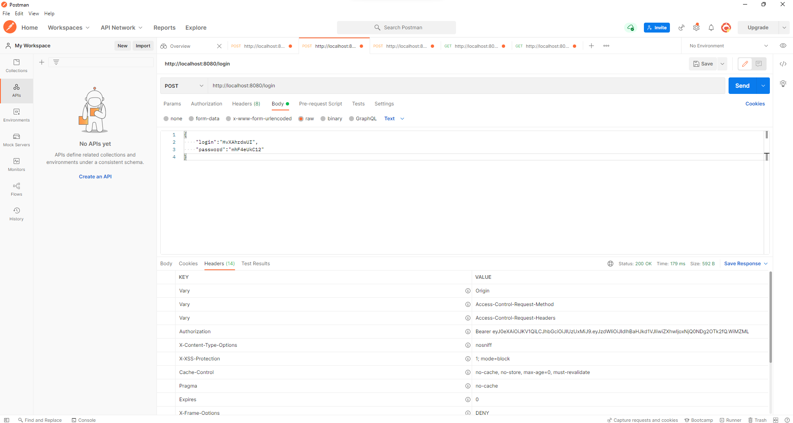
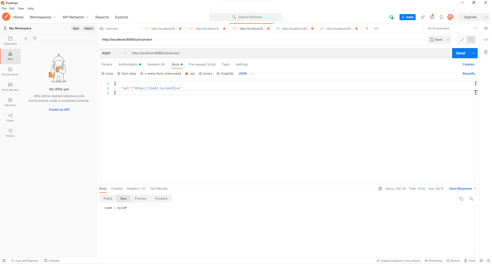
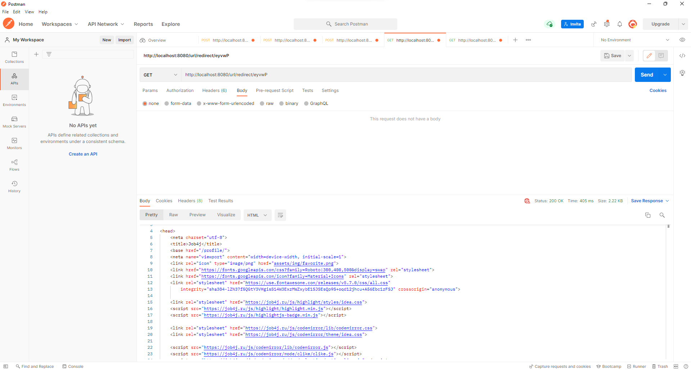
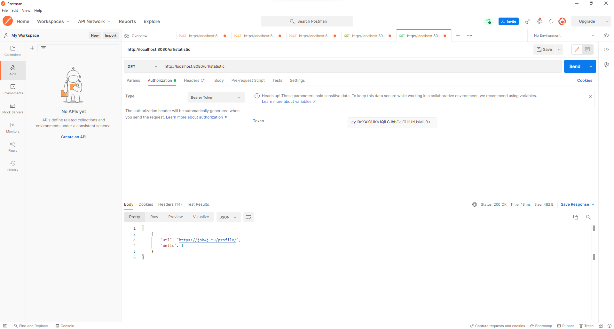

Url Shortcut
=============
This project is the REST-app: Url shortcut service. It uses Spring Boot and Spring Data. It also uses Spring Security with JWT for authentication and authorization.

User sends url. After successful registration of this url user receives login and password;

After successful authentication user receives unique authorization token

Authorized user sends url and receives shortcut for this url

Sending shortcut to "/redirect" redirects user to mapped url (authorization not required)

Authorized user can get statistics for all registered urls
